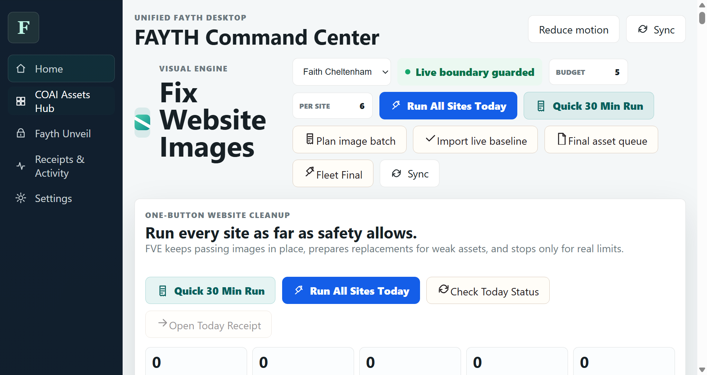
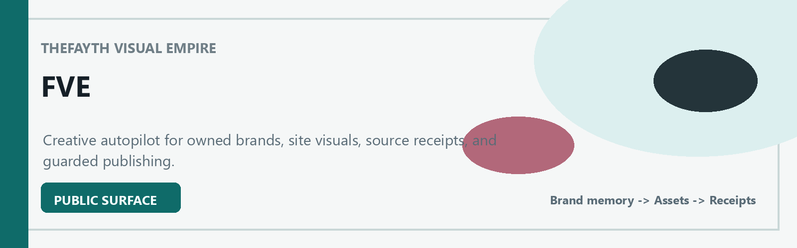
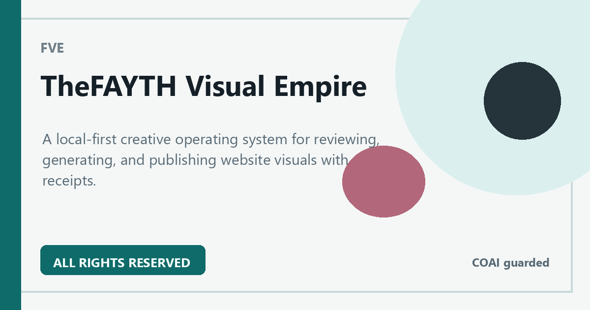
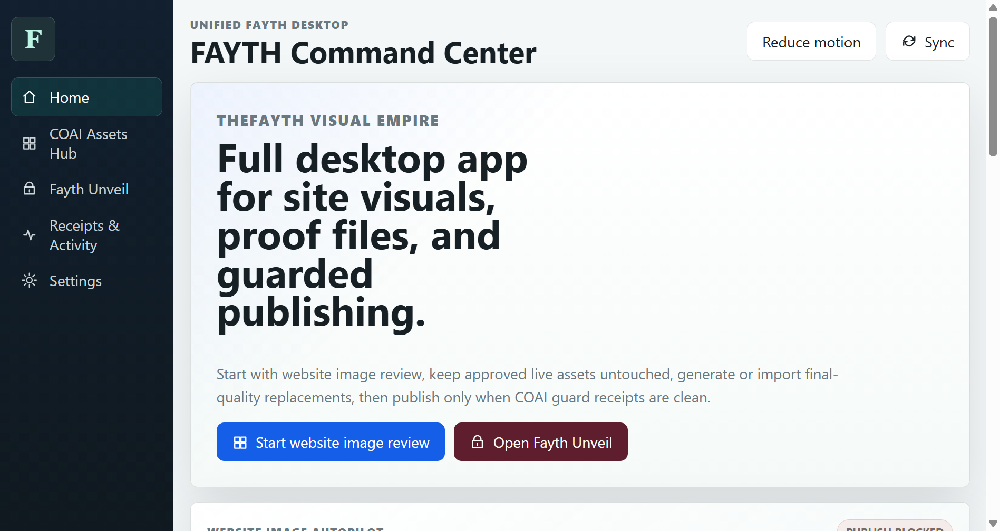

# TheFAYTH Visual Empire

Local-first creative autopilot for owned websites, brands, image receipts, and guarded publishing.

This repository is a protected public project surface. It is not the full source code, operational system, private workflow, or data room.

## What Is This?

TheFAYTH Visual Empire is a protected public project surface for a private Faith-built system. It explains the product purpose, current status, ownership posture, and public-safe workflow without publishing the engine itself.

## Why It Matters

It turns scattered site visuals, brand memory, approval history, and COAI publishing rules into one auditable creative operating system.

## Who It Is For

Faith, XXYYZZ Society LLC, trusted collaborators, and future partners who need to understand the public shape of FVE without seeing the private engine.

## How It Works

FVE gathers a brief and memory, plans or imports assets, records source receipts, reviews product fit, maps confirmed targets, and publishes only through guarded adapters.

## Visual Gallery

## What Is Public Here

- Product overview, status, roadmap, workflow diagrams, and WordPress page draft.
- Public-safe screenshots of the desktop command center and COAI Assets Hub.
- Brand notes, Canva asset plan, visual asset audit, and commercial-use boundaries.

## What Remains Private

- Source code, scripts, prompts, target registries, production credentials, rollback snapshots, and live publishing adapters.
- Private receipts, unpublished strategy files, customer or site data, and authentication workflows.
- Any credential-bearing COAI, WordPress, Canva, or server configuration.

## Current Status

Prepared public surface. The private FVE engine remains local-first and review-gated.

## Work With Faith

Faith offers quote-first website visual cleanup, AI brand system audits, GitHub/public surface packaging, local AI workflow setup, and protected-file/provenance consulting.

- Request a scoped project: [FaithCheltenham.com/contact](https://faithcheltenham.com/contact/)
- Project page: [TheFAYTH Visual Empire](https://faithcheltenham.com/projects/thefayth-visual-empire/)
- Portfolio and offers: [Faith AI Systems Portfolio](https://thefayth.github.io/faith-ai-systems-portfolio/)
- Licensing and partnership paths: [Licensing And Partnership Paths](https://thefayth.github.io/faith-ai-systems-portfolio/licensing-and-partnership-paths.html)
- Opportunity router: [Opportunity Router](https://thefayth.github.io/faith-ai-systems-portfolio/opportunity-router.html)
- Public proof snapshots: [Public Proof Snapshots](https://thefayth.github.io/faith-ai-systems-portfolio/public-proof-snapshots.html)
- Share / send kit: [Share / Send Kit](https://thefayth.github.io/faith-ai-systems-portfolio/share-send-kit.html)
- Work with Faith: [Work With Faith](https://thefayth.github.io/faith-ai-systems-portfolio/work-with-faith.html)
- Public prospect packet: [Prospect Packet](https://thefayth.github.io/faith-ai-systems-portfolio/prospect-packet.html)
- Sample deliverables: [Sample Deliverables](https://thefayth.github.io/faith-ai-systems-portfolio/sample-deliverables.html)
- Buyer FAQ: [Buyer FAQ](https://thefayth.github.io/faith-ai-systems-portfolio/buyer-faq.html)
- Pilot sprint menu: [Pilot Sprint Menu](https://thefayth.github.io/faith-ai-systems-portfolio/pilot-sprint-menu.html)
- Public proof index: [Public Proof Index](https://thefayth.github.io/faith-ai-systems-portfolio/public-proof-index.html)
- Referral and introduction kit: [Referral And Introduction Kit](https://thefayth.github.io/faith-ai-systems-portfolio/referral-introduction-kit.html)
- Request scope guide: [Request Scope](https://thefayth.github.io/faith-ai-systems-portfolio/scope-request.html)
- Investor or partner brief: [Investor And Partner Brief](https://thefayth.github.io/faith-ai-systems-portfolio/investor-partner-brief.html)
- Work with Faith details: [WORK_WITH_FAITH.md](WORK_WITH_FAITH.md)
- Commercial offers: [docs/COMMERCIAL_OFFERS.md](docs/COMMERCIAL_OFFERS.md)
- Ask about licensing or partnership: [FaithCheltenham.com/contact](https://faithcheltenham.com/contact/)

## How To Learn More

- Review the public docs in `docs/`.
- Read the WordPress draft in `wordpress/page.md`.
- Public project path recommendation: `/projects/thefayth-visual-empire/`
- Intended GitHub repository: [thefayth/thefayth-visual-empire](https://github.com/thefayth/thefayth-visual-empire)

## Ownership

Copyright (c) 2026 XXYYZZ Society LLC and Faith Cheltenham. All rights reserved.

No public license, source release, redistribution permission, training permission, commercial-use permission, or implied permission is granted.
