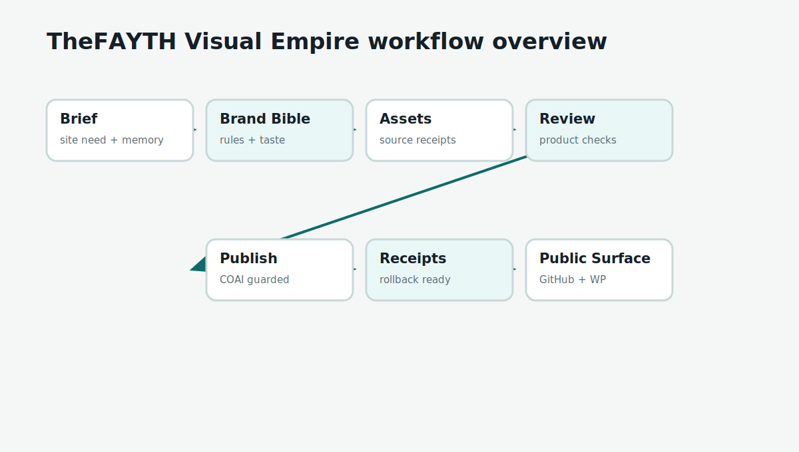
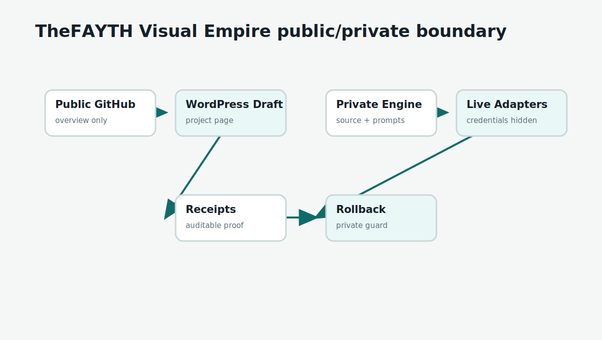

# Workflow Diagrams

## Workflow Overview

Source: `assets/diagrams/workflow-overview.mmd`

Rendered: `assets/diagrams/workflow-overview.svg`

## Public / Private Boundary

Source: `assets/diagrams/public-private-boundary.mmd`

Rendered: `assets/diagrams/public-private-boundary.svg`

